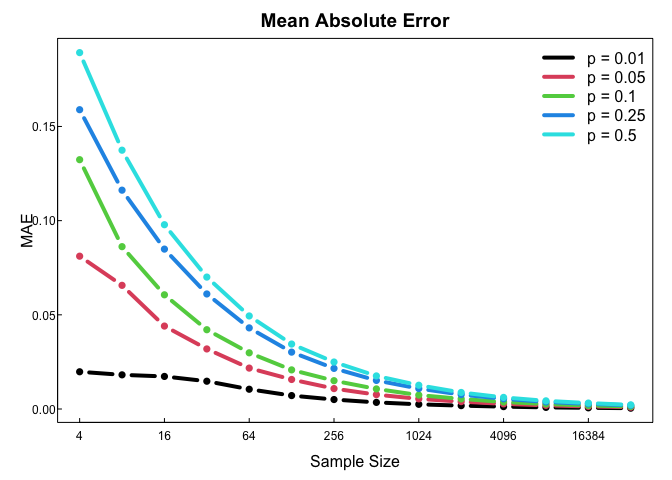
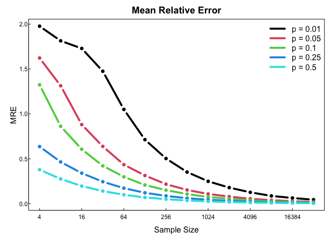
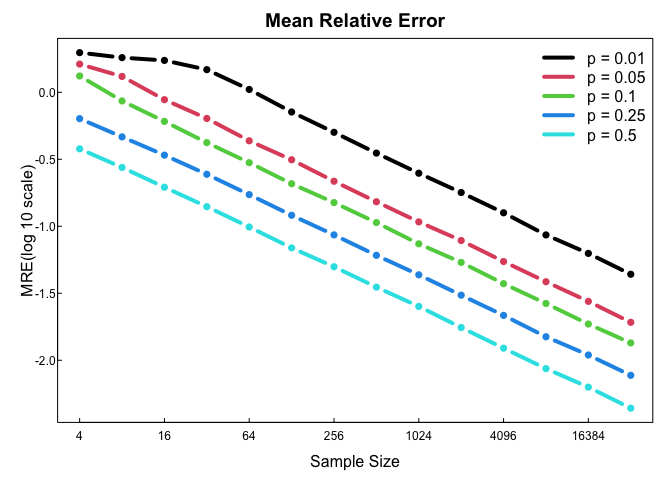

Monte Carlo Error
================
Soyeon Park
September 08, 2020

# Introduction

In this blog post, I am going to explain the concepts of absolute error
and relative error when estimating probabilities from simulation and
demonstrate it.

# Background

## Key vocabulary

Let p̂ denote the probability estimated from simulation, and let p
denote the true underlying probability.

-----

  - Absolute Error |p̂−p|
  - Relative Error |p̂−p|/p

-----

To help your understanding, I will take an example of car’s speed. While
you are driving, your car’s speedometer says your car is going 100mph.
However, you are actually going 105mph. In this case, the absolute error
of your speedometer is |100 - 105 | = 5mph. The relative error is 5 mph
/ 105 mph = 0.047 or 4.7%.

Let’s apply this example to the “statistical” concept. I will replicate
the exact same process using computer and record how many times result
“A” happens. “The number of result A happening / the number of
replicated action” is p̂ ( the probability estimated from simulation).
The real probability is p(the true underlying probability.) The
difference between these probabilities are “Absolute Error” and dividing
this into the true probability is “Relative Error”

## Why the concept is important?

In order to judge the accuracy of the measured probability from
simulation, we use the absolute error and the relative error. The
absolute error explains how much the measured probability differs from
the actual probability. The relative error gives us compared to the real
probability, whether the difference between what we’ve calculate through
simulation and the real probability, is big or small.

# Methods

Here is the simulation code I will use to explain absolute and relative
error.

``` r
require(magrittr)
library(tidyverse)
library(dplyr)

# Parameters
# Sample Size = 2^(2:15)
# Underlying true probability = c(0.01, 0.05, 0.1, 0.25, 0.5)
# Parameters will be a list
parameters <- list(ss = 4, p = .1, R = 5000)

# Process
# Generating binomial random variables(RV) of a specific sample size and specific probability.
create_data_estimate_p <- function(parameters) {
  parameters$phat <- rbinom(parameters$R, parameters$ss, parameters$p) / parameters$ss
  parameters
}

# Property
absolute_error <- function(parameters) {
  abs(parameters$phat - parameters$p)
}

# Absolute error |p_hat - p|
# Relative error |p_hat - p| / p
# Repeat
# Distributions
one_p_n <- function(parameters){
  ae <- parameters %>% create_data_estimate_p %>% absolute_error
  re <- ae / parameters$p
  mae <- mean(ae)
  mre <- mean(re)
  c(mae, mre)
}

simulation_settings <- expand.grid(
  R = 5000,
  p = c(0.01, 0.05, 0.1, 0.25, 0.5),
  ss = 2^(2:15),
  mae = NA_real_,
  mre = NA_real_,
  KEEP.OUT.ATTRS = FALSE
)

for(i in 1:nrow(simulation_settings)) {
  simulation_settings[i, c("mae", "mre")] <- simulation_settings[i, ] %>% as.list %>% one_p_n
}
```

# Results

## When the y-axis in on the normal scale

### MAE(Mean Absolute Error)

The higher the real probability is, the bigger the difference between
the probability estimated from simulation and the real probability,
which is absolute error, is. As the sample size is going larger, the
absolute error is getting smaller and finally it converges to zero.

``` r
# MAE Plots
require(tgsify)
require(data.table)

simulation_settings %>%
  mutate(col = factor(p) %>% as.numeric) %>%
  plotstyle(upright, mar = c(3, 3, 2, 1)) %>%
  plot_setup(mae ~ log(ss, base = 2)) %>%
  split(.$p) %>%
lwith({
  lines(log(ss, base = 2), mae, type = "b", col = col[1], lwd = 4)
  c(p[1], col[1])
  }) %>%
  do.call("rbind", .) %>%
  (function(x) {
    legend("topright", legend = "p = " %|% x[, 1], col = x[ ,2], lwd = 4, bty = "n")
  })
box()
axis(side = 1, at = axTicks(1), labels = 2^axTicks(1))
axis(2)
title(main = "Mean Absolute Error")
title(ylab = "MAE")
title(xlab = "Sample Size", line = 1.5)
```

<!-- -->

### MRE(Mean Relative Error)

As opposed to the MAE graph, the smaller the real probability is, the
higher MRE is. This is because the real probability is the number which
divides the absolute error. As the sample size is going larger, the
absolute error is getting smaller and finally it converges to zero.

``` r
# MRE Plots
simulation_settings %>%
  mutate(col = factor(p) %>% as.numeric) %>%
  plotstyle(upright, mar = c(3, 3, 2, 1)) %>%
  plot_setup(mre ~ log(ss, base = 2)) %>%
  split(.$p) %>%
lwith({
  lines(log(ss, base = 2), mre, type = "b", col = col[1], lwd = 4)
  c(p[1], col[1])
  }) %>%
  do.call("rbind",.) %>%
  (function(x) {
    legend("topright", legend = "p = " %|% x[, 1], col = x[, 2], lwd = 4, bty = "n")
  })

box()
axis(side = 1, at = axTicks(1), labels = 2^axTicks(1))
axis(2)
title(main = "Mean Relative Error")
title(ylab = "MRE")
title(xlab = "Sample Size", line = 1.5)
```

<!-- -->

## When the y-axis is on the log10 scale

### MAE(Mean Absolute Error)

When the y-axis in on the log10 scale, the MAE graph shows the trend of
linear function which has a negative slope. Since the value of the
absolute error is converging to zero as the number is getting bigger,
the value of log MAE becomes negative.

``` r
# MAE Plots
simulation_settings %>%
  mutate(col = factor(p) %>% as.numeric) %>%
  plotstyle(upright, mar = c(3, 3, 2, 1)) %>%
  plot_setup(log(mae, base = 10) ~ log(ss, base = 2)) %>%
  split(.$p) %>%
lwith({
  lines(log(ss, base = 2), log(mae, base = 10), type = "b", col = col[1], lwd = 4)
  c(p[1], col[1])
  }) %>%
  do.call("rbind", .) %>%
  (function(x) {
    legend("topright", legend = "p = " %|% x[, 1], col = x[ ,2], lwd = 4, bty = "n")
  })
box()
axis(side = 1, at = axTicks(1), labels = 2^axTicks(1))
axis(2)
title(main = "Mean Absolute Error")
title(ylab = "MAE(log 10 scale)")
title(xlab = "Sample Size", line = 1.5)
```

<!-- -->

### MRE(Mean Relative Error)

The graph of the MRE when the y-axis is on the log10 scale, also shows
the trend of linear functions which have a negative slope.

``` r
# MRE Plots
simulation_settings %>%
  mutate(col = factor(p) %>% as.numeric) %>%
  plotstyle(upright, mar = c(3, 3, 2, 1)) %>%
  plot_setup(log(mre, base = 10) ~ log(ss, base = 2)) %>%
  split(.$p) %>%
lwith({
  lines(log(ss, base = 2), log(mre, base = 10), type = "b", col = col[1], lwd = 4)
  c(p[1], col[1])
  }) %>%
  do.call("rbind",.) %>%
  (function(x) {
    legend("topright", legend = "p = " %|% x[, 1], col = x[, 2], lwd = 4, bty = "n")
  })

box()
axis(side = 1, at = axTicks(1), labels = 2^axTicks(1))
axis(2)
title(main = "Mean Relative Error")
title(ylab = "MRE(log 10 scale)")
title(xlab = "Sample Size", line = 1.5)
```

<!-- -->

# Conclusions

When estimating probabilities from simulation, the good probabilities
mean having less error(No error is the best\!). In order to judge the
accuracy of the estimated probability, we use absolute error and
relative error. We can know the absolute difference between the real
probability and the measured probability from simulation through the
absolute error. Also, The relative error tells us how the probability is
measured compared to the real probability.

If we want to measure accurate probability from simulation, we need to
replicate the process as much as we can because the more sample size is,
the less the absolute and relative error is. Also, the bigger the true
probability is, the more you need to make sure you have enough sample
size because the bigger the true probability is, the bigger error it has
when the sample size is small.
