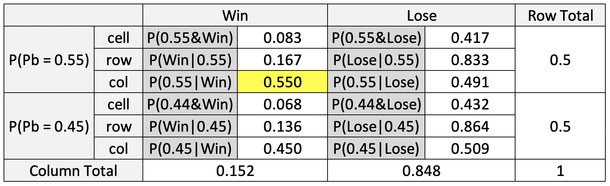

# Introduction

In this blog post, I am going to solve problems regarding __the rules of probability and discrete probability functions.__

## Problem

__How often does the better team win the World Series?__

Setup:

1.  Suppose that the Braves and the Yankees are teams competing in the
    World Series.
2.  Suppose that in any given game, the probability that the Braves win
    is *P*<sub>*B*</sub> and the probability that the Yankees win is
    *P*<sub>*Y*</sub> = 1 − *P*<sub>*B*</sub>.
    
Questions to answer:

1. What is the probability that the Braves win the World Series given that PB = 0.55?
2. What is the probability that the Braves win the World Series given that PB = x? This will be a figure (see below) with PB on the x-axis and P(Braves win World Series) on the y-axis.
3. Suppose one could change the World Series to be best-of-9 or some other best-of-X series. What is the shortest series length so that P(Braves win World Series|PB = .55) ≥ 0.8
4. What is the shortest series length so that P(Braves win World Series|PB = x) ≥ 0.8? This will be a figure (see below) with PB on the x-axis and series length is the y-axis.
5. Calculate P(PB = 0.55|Braves win World Series in 7 games) under the assumption that either PB = 0.55 or PB = 0.45. Explain your solution.

## Background

### Negative binomial random variable
: the number of failures before the Kth success in Bernoulli sequence.
* For Bernoulli sequence, successive replications(trials) of the process are independent.^["independent" means each process does not give impact on the others.]

There are two kinds of negative binomial random variables.

1. `dnbinom(x, r, probability)`
: the probability of x failures prior to the "r"th success, when the probability of success is "probability". This returns the probability for one specific case. Let's look at an example:

***
__An oil company has a P = 0.3 chances of striking oil when the probability the company drills x = 5 wells to strike oil r = 3 times?__

***

For this problem, we can use `dnbinom`, since this is about one specific situation. The oil company tried 5 times but they succeed only 3 times. Before the company's 3rd success, they failed to strike oil (5-3) = 2 times.

```r
dnbinom(2, 3, 0.3)
```

```
## [1] 0.07938
```
The answer is 0.07938.

2. `pnbinom(x, r, probability)`
: it returns the cumulative distribution function of the negative binomial distribution. We can use this when we want to calculate the sum of more than one probability.(range) Let's look at an example:

***
__The probability of 2 or fewer tails before 3th head__

***

As this is the sum of the probabilities of 2 tails, 1 tails and 0 tails before 3th head, we can use `pnbinom`.

```r
pnbinom(2, 3, 0.5)
```

```
## [1] 0.5
```
The answer is 0.5

# Results
##  What is the probability that the Braves win the World Series given that *P*<sub>*B*</sub> = 0.55?
    
Following the rule, the team who wins four games first will be the winner. No matter how many times they play, the 4th winner of the games must be the Braves if the Braves win the World Series. Before the Brave's 4th win, they can lose from none to 3 times. If the number of the Braves' lose is same or more than 4, they cannot win the World Series. Therefore, I need to calculate the probability that 3 or fewer times the Braves lose before their 4th winning.
    

```r
pnbinom(3, 4, 0.55)
```

```
## [1] 0.6082878
```

## What is the probability that the Braves win the World Series given that *P*<sub>*B*</sub> = *x*? 
This will be a figure (see below) with *P*<sub>*B*</sub> on the x-axis and *P*(Braves win World Series) on the y-axis.

I set x-axis as the probability of the Braves' winning per game, and y-axis as the probability that the Braves wins the World Series. Since the probability starts at 0, and ends at 1, the range of the probability is (0,1). For y-axis, I made function about x, which calculates the probability that the Braves wins the World Series depending on the probability of the Braves' winning per game(x).


```r
x <- seq(0, 1, by = 0.001)
y <- pnbinom(3, 4, x)
```

```
## Warning in pnbinom(3, 4, x): NaNs produced
```

```r
plot(x, y, main = "Probability of winning the World Series", xlab = "Probability of the Braves winning a head-to-head match up", ylab = "Pr(the Braves Win World Series)", type = "l")
```

<!-- -->

The higher the probability of the Braves' winning per game is, the higher the probability that the Braves wins the World Series. What's interesting is that as of x=0.5, the inflection point of plot is changed. From x=0 to x=0.5, the plot is concave, but from x=0.5 to x=1.0, it is convex. Since the Braves' win is the Yankees' lose, the graphic shows symmetric as of x = 0.5.
    
## Suppose one could change the World Series to be best-of-9 or some other best-of-X series. What is the shortest series length so that *P*(Braves win World Series\|*P*<sub>*B*</sub> = .55) ≥ 0.8?

The `num_games` is a group of possible length of series. It must be odd number because if the number of series length is even, there are some cases when we can't divide two teams into winner and loser. As a result, I set the gap of `num_games` as 2 to make odd numbers. 

The winner of the World Series must win `((num_games[i] + 1) / 2)` times, which means they will lose `((num_games[i] - 1) / 2)` or fewer times before the winner's `((num_games[i] + 1) / 2)`th win. The series length is the sum of `((num_games[i] + 1) / 2)` and `((num_games[i] - 1) / 2)`.

I used pnbinom to calculate the probability that the Braves lose `((num_games[i] - 1) / 2)` or fewer times before `((num_games[i] + 1) / 2)`th win.

Through the `for` loop, I calculated from when length of series is 9, and once the probability that the Braves win the World Series is same or more than 0.8, the loop stops.


```r
prob_win <- NA
num_games <- seq(9, 100, 2)

for(i in 1:length(num_games)){
  num_lose <- (num_games[i] - 1) / 2
  num_wins <- (num_games[i] + 1) / 2
  
  prob_win[i] <- pnbinom(num_lose, num_wins, 0.55)
  
  if(prob_win[i] >= 0.8){
    print(num_games[i])
    break
  }
}
```

```
## [1] 71
```

__The shortest series length so that *P*(Braves win World Series\|*P*<sub>*B*</sub> = .55) ≥ 0.8 is 71.__

## What is the shortest series length so that *P*(Braves win World Series\|*P*<sub>*B*</sub> = *x*) ≥ 0.8? 
This will be a figure (see below) with *P*<sub>*B*</sub> on the x-axis and series length is the y-axis.

I set the `prob_braves` as the x-axis, and `short_series` as the y-axis. I made the `num_win` list which has a series of number from 1 to 1000. The maximum number of the Brave's loss is `num_win-1` and I gave the name `num_loss` to it. 

By using the `for` loop, I calculated the probability that the Braves wins the World Series depending on the probability of the Braves' winning per game. Among these probabilities, the values same or bigger than 0.8 are selected. Finally, In order to find the shortest length, the first value of the selected ones is saved in `short_series`. 


```r
prob_braves <- seq(0.5, 1, by = 0.001)
short_series <- NA
num_win <- seq(1, 1000, by = 1)
num_loss <- num_win - 1

for(i in 1:length(prob_braves)){
  prob_win <- pnbinom(num_loss, num_win, prob_braves[i])
  length_series <- num_win + num_loss
  short_series[i] <- length_series[which(prob_win >= 0.8)[1]]
}

plot(prob_braves, short_series, type = "l", main = "Shortest series so that P(win WS given p)>= 0.8", xlab = "Probability of the Braves winning a head-to head matchup", ylab = "Series Length")
```

<!-- -->

The plot shows that the higher the probability that the Braves wins per game is, the less series length is needed to make the probability that the Braves wins the World Series same or bigger than 0.8. If the probability of the Braves winning a head-to-head matchup is less than 0.5, it takes potentially millions of games to make a probability of winning the world series same or bigger than 0.8.

## Calculate *P*(*P*<sub>*B*</sub> = 0.55\|Braves win World Series in 7 games) under the assumption that either *P*<sub>*B*</sub> = 0.55 or *P*<sub>*B*</sub> = 0.45. Explain your solution.

This question is asking for the conditional probability that the probability for the Braves' winning per game is 0.55 given that the Braves wins the World Series in 7 games.

First, we can calculate the conditional probability that the Braves wins the World Series given that the probability for the Braves' winning per game is 0.55. This is the probability of the specific one situation; the Braves win the 7th game and win the World Series. This is the probability of 3 lose prior to the 4th win by using `dnbinom`

```r
dnbinom(3, 4, 0.55)
```

```
## [1] 0.1667701
```

0.167 is the *P*(Braves win World Series in 7 games | *P*<sub>*B*</sub> = 0.55\). With the same logic, *P*(Braves win World Series in 7 games | *P*<sub>*B*</sub> = 0.45\) is 0.136.

```r
dnbinom(3, 4, 0.45)
```

```
## [1] 0.1364483
```

As the question assumes that *P*<sub>*B*</sub> is either 0.55 or 0.45, the marginal probabilities of both is 0.5.

Using these probabilities, we can make the table like this:
{#id .class width=200% height=100%}

Then we can calculate the cell probabilities like this:

*P*(*P*<sub>*B*</sub> = 0.55\&Braves win World Series in 7 games) = *P*(Braves win World Series in 7 games | *P*<sub>*B*</sub> = 0.55\) * *P*(*P*<sub>*B*</sub> = 0.55) = 0.167 * 0.5 = 0.083

*P*(*P*<sub>*B*</sub> = 0.45\&Braves win World Series in 7 games) = *P*(Braves win World Series in 7 games | *P*<sub>*B*</sub> = 0.45\) * *P*(*P*<sub>*B*</sub> = 0.45) = 0.136 * 0.5 = 0.068


***


Now, we can calculate the column probabilities like this:

*P*(*P*<sub>*B*</sub> = 0.55\&Braves win World Series in 7 games) / (*P*(*P*<sub>*B*</sub> = 0.55\&Braves win World Series in 7 games) + *P*(*P*<sub>*B*</sub> = 0.45\&Braves win World Series in 7 games)) = 0.083 / (0.083 + 0.068) = 0.550

*P*(*P*<sub>*B*</sub> = 0.45\&Braves win World Series in 7 games) / (*P*(*P*<sub>*B*</sub> = 0.45\&Braves win World Series in 7 games) + *P*(*P*<sub>*B*</sub> = 0.55\&Braves win World Series in 7 games)) = 0.068 / (0.068 + 0.083) = 0.450


***


Finally, we can fill the rest of the table like this:
{#id .class width=200% height=100%}

__In summarize, the answer for this question is 0.55.__

# Conclusions

While the `dnbinom` returns the probability that the probability of "x" failures prior to the "r"th success, which is one specific case, the `pnbinom` returns the __cumulative__ distribution function of the negative binomial distribution, which is a range. `pnbinom` can be expressed by using `dnbinom`. For example, the probability that I calculated using `pnbinom` can be expressed like this:

```r
dnbinom(0, 4, 0.55) + dnbinom(1, 4, 0.55) + dnbinom(2, 4, 0.55) + dnbinom(3, 4, 0.55)
```

```
## [1] 0.6082878
```
The value above is same as what I calculated using `pnbinom` like this:

```r
pnbinom(3, 4, 0.55)
```

```
## [1] 0.6082878
```

Also, following Bayes' rule, we can fill the Bayes' probability table with a few of information. For example, in the question 5, I was able to calculate all probabilities in the table only with some marginal probabilities and some row probabilities.
