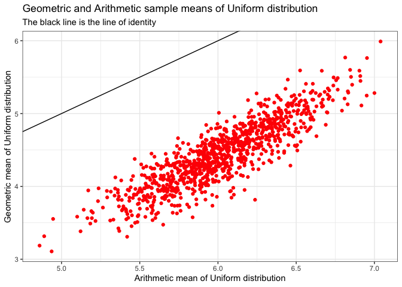
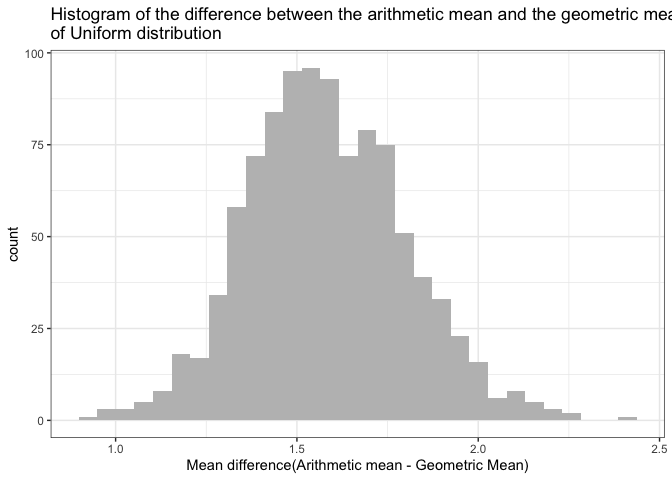

In this blog post, I am going to answer a series of questions related to the transformation of data.

# Background

1. Gamma Distribution

The gamma distribution requires two-parameters: a shape parameter k and a scale parameter θ. With a shape parameter α = k and an inverse scale parameter β = 1/θ, called a rate parameter.

- With a shape parameter k and a scale parameter θ, we can know the mean of gamma distribution: (mean = scale * shape)
- For median, there is no simple closed form

2. Log Normal Distribution

If the random variable X is log-normally distributed, then Y = ln(X) has a normal distribution. A random variable which is log-normally distributed takes only positive real values. For this distribution, we need mean(μ) and standard deviation(σ).

- Mean : exp(μ + σ*σ/2)
- Median : exp(μ)

# Questions

Part 1
------

### Distribution 1

*X* ∼ GAMMA(shape = 3, scale = 1)

-   For each distribution below, generate a figure of the PDF and CDF.
    Mark the mean and median in the figure.

PDF of Gamma Distribution
------


```r
library(ggplot2)
library(magrittr)
library(ggpubr)

x <- seq(-1, 10, by = 0.01)
pdf <- dgamma(x, shape = 3, scale = 1)
cdf = pgamma(x, shape = 3, scale = 1)

gamma_data <- data.frame(x, pdf, cdf)
mean_gam <- 3*1
median_gam <- qgamma(0.5, shape = 3, scale = 1)

ggplot(gamma_data, aes(x = x)) + 
  geom_line(aes(y = pdf)) + 
  theme_bw() + 
  labs(title = "PDF of the Gamma Distribution", x = "X", y = "Probability Density", subtitle = "The red line shows mean (mean = shape * scale)") + 
  geom_vline(xintercept = mean_gam, col = "red", lable= "mean")
```

```
## Warning: Ignoring unknown parameters: lable
```

<!-- -->

CDF of Gamma Distribution
------


```r
ggplot(gamma_data, aes(x = x)) + 
  geom_line(aes(y = cdf)) + 
  geom_vline(xintercept = median_gam, col = "blue") +
  theme_bw() +
  labs(title = "CDF of the Gamma Distribution", x = "X", y = "Probability", subtitle = "The blue line shows median (median = x where the probability is 0.5)")
```

<!-- -->

-   For each distribution below, generate a figure of the PDF and CDF of
    the transformation Y = log(X) random variable. Mark the mean and
    median in the figure. You may use simulation or analytic methods in
    order find the PDF and CDF of the transformation.

PDF of log(x) Gamma Distribution
------


```r
gamma_var <- rgamma(1000000, shape = 3, scale = 1)
log_gamma <- log(gamma_var)
log_gamma_data <- data.frame(gamma_var,log_gamma)
log_gamma_mean <- mean(log_gamma)

ggplot(log_gamma_data) +
  geom_density(aes(x = log_gamma)) +
  theme_bw() +
  labs(title = "PDF of the transformation y = log(x) gamma random variable", x = "log(x)", y = "Probability Density", subtitle = "The red line shows mean") +
  geom_vline(xintercept = log_gamma_mean, col = "red")
```

<!-- -->

CDF of log(x) Gamma Distribution
------


```r
plot(ecdf(log_gamma), main = "CDF of the transformation y=log(x) gamma random variable", ylab = "Probability", xlab = "log(x)")
mtext("The blue line shows median")

log_gamma_median <- quantile(ecdf(log_gamma), 0.5)
abline(v = log_gamma_median, col = "blue")
```

<!-- -->

-   For each of the distributions below, generate 1000 samples of
    size 100. For each sample, calculate the geometric and arithmetic
    mean. Generate a scatter plot of the geometic and arithmetic sample
    means. Add the line of identify as a reference line.

```r
gamma_arithmetic_mean <- NA
gamma_geometric_mean <- NA
gamma_mean_diff <- NA

for(i in 1:1000) {
  gamma_x <- rgamma(100, shape = 3, scale = 1)
  gamma_arithmetic_mean[i] <- mean(gamma_x)
  gamma_geometric_mean[i] <- exp(mean(log(gamma_x)))
  gamma_mean_diff[i] <- gamma_arithmetic_mean[i] - gamma_geometric_mean[i]
}

gamma_mean_data <- data.frame(gamma_x, gamma_arithmetic_mean, gamma_geometric_mean, gamma_mean_diff)

ggplot(gamma_mean_data,aes(x = gamma_arithmetic_mean, y = gamma_geometric_mean)) + 
  geom_point(col = "red") +
  geom_abline(slope = 1, intercept = 0) + 
  theme_bw() +
  labs(title = "Geometric and Arithmetic sample means of gamma distribution", subtitle = "The black line is the line of identity", x = "Arithmetic mean of gamma distribution", y = "Geometric mean of gamma distribution")
```

<!-- -->

-   Generate a histogram of the difference between the arithmetic mean
    and the geometric mean.

```r
ggplot(gamma_mean_data, aes(x = gamma_mean_diff)) +
  geom_histogram(fill = "gray") + 
  theme_bw() + 
  labs(title = "Histogram of the difference between the arithmetic mean and the geometric mean 
of gamma distribution", x = "Mean difference(Arithmetic mean - Geometric Mean)")
```

```
## `stat_bin()` using `bins = 30`. Pick better value with `binwidth`.
```

<!-- -->

***
***
### Distribution 2

*X* ∼ LOG NORMAL(*μ* =  − 1, *σ* = 1)

-   For each distribution below, generate a figure of the PDF and CDF.
    Mark the mean and median in the figure.
    
PDF of Log Normal Distribution
------

```r
x <- seq(-1, 5, by = 0.01)
pdf <- dlnorm(x, meanlog = -1, sdlog = 1)
cdf = plnorm(x, meanlog = -1, sdlog = 1)

lnorm_data <- data.frame(x, pdf, cdf)
mean_lnorm <- exp(-1 + 0.5)
median_lnorm <- exp(-1)

ggplot(lnorm_data, aes(x = x)) + 
  geom_line(aes(y = pdf)) + 
  theme_bw() + 
  labs(title = "PDF of the Log Normal Distribution", x = "X", y = "Probability Density", subtitle = "The red line shows mean") + 
  geom_vline(xintercept = mean_lnorm, col = "red", lable= "mean")
```

```
## Warning: Ignoring unknown parameters: lable
```

<!-- -->
CDF of Log Normal Distribution
------    

```r
ggplot(lnorm_data, aes(x = x)) + 
  geom_line(aes(y = cdf)) + 
  geom_vline(xintercept = median_lnorm, col = "blue") +
  theme_bw() +
  labs(title = "CDF of the Log Uniform Distribution", x = "X", y = "Probability", subtitle = "The blue line shows median (median = x where the probability is 0.5)")
```

<!-- -->

-   For each distribution below, generate a figure of the PDF and CDF of
    the transformation Y = log(X) random variable. Mark the mean and
    median in the figure. You may use simulation or analytic methods in
    order find the PDF and CDF of the transformation.
    
PDF of log(x) Log Normal Distribution
------
    
    
    ```r
    lnorm_var <- rlnorm(1000000, meanlog = -1, sdlog = 1)
    log_lnorm <- log(lnorm_var)
    log_lnorm_data <- data.frame(lnorm_var,log_lnorm)
    log_lnorm_mean <- mean(log_lnorm)
    
    ggplot(log_lnorm_data) +
      geom_density(aes(x = log_lnorm)) +
      theme_bw() +
      labs(title = "PDF of the transformation y = log(x) Log Uniform random variable", x = "log(x)", y = "Probability Density", subtitle = "The red line shows mean") +
      geom_vline(xintercept = log_lnorm_mean, col = "red")
    ```
    
    <!-- -->

CDF of log(x) Log Normal Distribution
------


```r
plot(ecdf(log_lnorm), main = "CDF of the transformation y=log(x) Log Uniform random variable", ylab = "Probability", xlab = "log(x)")
mtext("The blue line shows median")

log_lnorm_median <- quantile(ecdf(log_lnorm), 0.5)
abline(v = log_lnorm_median, col = "blue")
```

<!-- -->

-   For each of the distributions below, generate 1000 samples of
    size 100. For each sample, calculate the geometric and arithmetic
    mean. Generate a scatter plot of the geometic and arithmetic sample
    means. Add the line of identify as a reference line.
    
    ```r
    lnorm_arithmetic_mean <- NA
    lnorm_geometric_mean <- NA
    lnorm_mean_diff <- NA
    
    for(i in 1:1000) {
      lnorm_x <- rlnorm(100, meanlog = -1, sdlog = 1)
      lnorm_arithmetic_mean[i] <- mean(lnorm_x)
      lnorm_geometric_mean[i] <- exp(mean(log(lnorm_x)))
      lnorm_mean_diff[i] <- lnorm_arithmetic_mean[i] - lnorm_geometric_mean[i]
    }
    
    lnorm_mean_data <- data.frame(lnorm_x, lnorm_arithmetic_mean, lnorm_geometric_mean, lnorm_mean_diff)
    
    ggplot(lnorm_mean_data,aes(x = lnorm_arithmetic_mean, y = lnorm_geometric_mean)) + 
      geom_point(col = "red") +
      geom_abline(slope = 1, intercept = 0) + 
      theme_bw() +
      labs(title = "Geometric and Arithmetic sample means of Log Normal distribution", subtitle = "The black line is the line of identity", x = "Arithmetic mean of gamma distribution", y = "Geometric mean of gamma distribution")
    ```
    
    <!-- -->
  
-   Generate a histogram of the difference between the arithmetic mean
    and the geometric mean.
    
    ```r
    ggplot(lnorm_mean_data, aes(x = lnorm_mean_diff)) +
      geom_histogram(fill = "gray") + 
      theme_bw() + 
      labs(title = "Histogram of the difference between the arithmetic mean and the geometric mean 
    of Log Normal distribution", x = "Mean difference(Arithmetic mean - Geometric Mean)")
    ```
    
    ```
    ## `stat_bin()` using `bins = 30`. Pick better value with `binwidth`.
    ```
    
    <!-- -->
    
***
***
    
### Distribution 3

*X* ∼ UNIFORM(0, 12)

-   For each distribution below, generate a figure of the PDF and CDF.
    Mark the mean and median in the figure.

PDF of Uniform Distribution
------  
    

```r
x <- seq(-1, 13, by = 0.01)
pdf <- dunif(x, min = 0, max = 12)
cdf = punif(x, min = 0, max = 12)

uni_data <- data.frame(x, pdf, cdf)
mean_uni <- (0 + 12) / 2
median_uni <- qunif(0.5, min = 0, max = 12)

ggplot(uni_data, aes(x = x)) + 
  geom_line(aes(y = pdf)) + 
  theme_bw() + 
  labs(title = "PDF of the Uniform Distribution", x = "X", y = "Probability Density", subtitle = "The red line shows mean") + 
  geom_vline(xintercept = mean_uni, col = "red", lable= "mean")
```

```
## Warning: Ignoring unknown parameters: lable
```

<!-- -->

CDF of Uniform Distribution
------   


```r
ggplot(uni_data, aes(x = x)) + 
  geom_line(aes(y = cdf)) + 
  geom_vline(xintercept = median_uni, col = "blue") +
  theme_bw() +
  labs(title = "CDF of the Uniform Distribution", x = "X", y = "Probability", subtitle = "The blue line shows median (median = x where the probability is 0.5)")
```

<!-- -->

-   For each distribution below, generate a figure of the PDF and CDF of
    the transformation Y = log(X) random variable. Mark the mean and
    median in the figure. You may use simulation or analytic methods in
    order find the PDF and CDF of the transformation.
    
PDF of log(x) Normal Distribution
------ 
    

```r
uni_var <- runif(1000000, min = 0, max = 12)
log_uni <- log(uni_var)
log_uni_data <- data.frame(uni_var,log_uni)
log_uni_mean <- mean(log_uni)

ggplot(log_uni_data) +
  geom_density(aes(x = log_uni)) +
  theme_bw() +
  labs(title = "PDF of the transformation y = log(x) Uniform random variable", x = "log(x)", y = "Probability Density", subtitle = "The red line shows mean") +
  geom_vline(xintercept = log_gamma_mean, col = "red") +
  scale_x_continuous(limits = c(-5, 10))
```

```
## Warning: Removed 548 rows containing non-finite values (stat_density).
```

<!-- -->

CDF of log(x) Normal Distribution
------ 


```r
plot(ecdf(log_uni), main = "CDF of the transformation y=log(x) Uniform random variable", ylab = "Probability", xlab = "log(x)", xlim = c(-5, 10))
mtext("The blue line shows median")

log_uni_median <- quantile(ecdf(log_uni), 0.5)
abline(v = log_uni_median, col = "blue")
```

<!-- -->

-   For each of the distributions below, generate 1000 samples of
    size 100. For each sample, calculate the geometric and arithmetic
    mean. Generate a scatter plot of the geometic and arithmetic sample
    means. Add the line of identify as a reference line.

```r
uni_arithmetic_mean <- NA
uni_geometric_mean <- NA
uni_mean_diff <- NA

for(i in 1:1000) {
  uni_x <- runif(100, min = 0, max = 12)
  uni_arithmetic_mean[i] <- mean(uni_x)
  uni_geometric_mean[i] <- exp(mean(log(uni_x)))
  uni_mean_diff[i] <- uni_arithmetic_mean[i] - uni_geometric_mean[i]
}

uni_mean_data <- data.frame(uni_x, uni_arithmetic_mean, uni_geometric_mean, uni_mean_diff)

ggplot(uni_mean_data,aes(x = uni_arithmetic_mean, y = uni_geometric_mean)) + 
  geom_point(col = "red") +
  geom_abline(slope = 1, intercept = 0) + 
  theme_bw() +
  labs(title = "Geometric and Arithmetic sample means of Uniform distribution", subtitle = "The black line is the line of identity", x = "Arithmetic mean of Uniform distribution", y = "Geometric mean of Uniform distribution")
```

<!-- -->

-   Generate a histogram of the difference between the arithmetic mean
    and the geometric mean.
    
    ```r
    ggplot(uni_mean_data, aes(x = uni_mean_diff)) +
      geom_histogram(fill = "gray") + 
      theme_bw() + 
      labs(title = "Histogram of the difference between the arithmetic mean and the geometric mean 
    of Uniform distribution", x = "Mean difference(Arithmetic mean - Geometric Mean)")
    ```
    
    ```
    ## `stat_bin()` using `bins = 30`. Pick better value with `binwidth`.
    ```
    
    <!-- -->
    
Part 2
------

Show that if *X*<sub>*i*</sub> \> 0 for all *i*, then the arithmetic
mean is greater than or equal to the geometric mean.

Hint: Start with the sample mean of the transformation
*Y*<sub>*i*</sub> = log (*X*<sub>*i*</sub>).

* Simulation

I am going to simulate 100000 experiments with 1000 sample sizes. I will calculate 100000 experiments' arithmetic mean and geometric mean, and I will plot them to show the relationship between them.

```r
uni_arithmetic_mean <- NA
uni_geometric_mean <- NA

for(i in 1:100000) {
  uni_x <- runif(1000, min = 0, max = 12)
  uni_arithmetic_mean[i] <- mean(uni_x)
  uni_geometric_mean[i] <- exp(mean(log(uni_x)))
}

uni_mean_data <- data.frame(uni_x, uni_arithmetic_mean, uni_geometric_mean)

ggplot(uni_mean_data,aes(x = uni_geometric_mean, y = uni_arithmetic_mean)) + 
  geom_point(col = "red", size = 0.1) +
  geom_abline(slope = 1, intercept = 0) + 
  coord_cartesian(xlim = c(3,7), ylim = c(3,7)) +
  theme_bw() +
  labs(title = "Geometric and Arithmetic sample means", subtitle = "The black line is the line of identity", x = "Geometric mean", y = "Arithmetic mean")
```

<!-- -->

As you can see above, arithmetic mean is always greater than geometric mean. However, if all *X*<sub>*i* 
is equal to 1, the arithmetic mean is same with the geometric mean. You can see this trend output in other distribution(gamma distribution and log normal distribution) in Part 1. Therefore, if *X*<sub>*i*</sub> \> 0 for all *i*, then the arithmetic
mean is greater than or equal to the geometric mean.

Part 3
------

What is the correct relationship between E[log (X)] and log (E[X])? Is one always larger? Equal? Explain your answer.

* Simulation

I am going to simulate 100000 experiments with 1000 sample sizes. I will calculate 100000 experiments' E[log (X)] and log (E[X]), and I will plot them to show the relationship between them.


```r
e_log_x <- NA
log_e_x <- NA

for(i in 1:100000) {
  uni_x <- runif(1000, min = 0, max = 12)
  log_x <- log(uni_x)
  e_log_x[i] <- mean(log_x)
  log_e_x[i] <- log(mean(uni_x))
}

uni_mean_data <- data.frame(uni_x, e_log_x, log_e_x)

ggplot(uni_mean_data,aes(x = e_log_x, y = log_e_x)) + 
  geom_point(col = "red", size = 0.1) +
  geom_abline(slope = 1, intercept = 0) + 
  coord_cartesian(xlim = c(1.25,2), ylim = c(1.25,2)) +
  theme_bw() +
  labs(title = "The relationship between E[log (X)] and log (E[X])", subtitle = "The black line is the line of identity", x = "E[log (X)]", y = "log (E[X])")
```

<!-- -->

As you can see above, log (E[X]) is always greater than E[log (X)]. However, if all *X*<sub>*i*    is equal to 1, log (E[X]) is same with E[log (X)]. Therefore, log (E[X]) is greater than or equal to E[log (X)].

# Conclusions

if *X*<sub>*i*</sub> \> 0 for all *i*, then the arithmetic
mean is greater than or equal to the geometric mean. log (E[X]) is greater than or equal to E[log (X)].
