Final Exam
================

# 1\. Simulation

The Monte Hall problem is a classic game show. Contestants on the show
where shown three doors. Behind one randomly selected door was a
sportscar; behind the other doors were goats.

At the start of the game, contestants would select a door, say door A.
Then, the host would open either door B or C to reveal a goat. At that
point in the game, the host would ask the contestant if she would like
to change her door selection. Once a contestant decided to stay or
change, the host would open the choosen door to reveal the game prize,
either a goat or a car.

In this problem, consider a **modified** version of the Monte Hall
problem in which the number of doors is **variable**. Rather than 3
doors, consider a game with 4 or 5 or 50 doors. In the modified version
of the game, a contestant would select an initial door, say door A.
Then, the host would open **one** of the remaining doors to reveal a
goat. At that point in the game, the host would ask the contestant if
she would like to change her door selection. Once a contestant decided
to stay or change, the host would open the choosen door to reveal the
game prize, either a goat or a car.

Consider two strategies:

1.  Always stay with the first door selected.
2.  Always switch to the unopened door.

**C.** The function `game` below plays a single game of Monte Hall. The
function returns a vector of length two, the first element is the prize
under strategy 1 and the second element is the prize under strategy 2.
The function has a single input parameter, N, which is the number of
doors in the game.

Use the `game` function to estimate the probability that both strategies
result in a goat. Let **N=4**.

``` r
library(stats4)
library(tgsify)
library(tidyverse)
```

``` r
require(magrittr)
require(dplyr)

game <- function(N){
  if(N<3) stop("Must have at least 3 doors")
  prize <- sample(c(rep("goat",N-1),"car"), N)
  guess <- sample(1:N,1)
  game <- data.frame(door = 1:N, prize = prize, stringsAsFactors = FALSE) %>% 
    mutate(first_guess = case_when(
      door == guess ~ 1
      , TRUE ~ 0
    )) %>% 
    mutate(potential_reveal = case_when(
        first_guess == 1 ~ 0
      , prize == "car" ~ 0
      , TRUE ~ 1
    )) %>% 
    mutate(reveal = 1*(rank(potential_reveal, ties.method = "random") == 3)) %>% 
    mutate(potential_switch = case_when(
      first_guess == 1 ~ 0
      , reveal == 1 ~ 0
      , TRUE ~ 1
    )) %>% 
    mutate(switch = 1*(rank(potential_switch, ties.method = "random") == 3))
  c(game$prize[game$first_guess == 1], game$prize[game$switch == 1])
}

# simulation setting
a = NA
strategy1 = rep(NA, 1000) # vector for prize of strategy 1
strategy2 = rep(NA, 1000) # vector for prize of strategy 2
same_result = rep(NA, 1000)

# simulation
for (i in seq_along(strategy1)) {
  a <- game(N = 4)
  strategy1[i] <- a[1]
  strategy2[i] <- a[2]
  
  same_result[i] <- ifelse(((strategy1[i] == "goat")&(strategy2[i] == "goat")), 1, 0) # If both results are goats, assign 1 to the list "same_result"
}

# The probability that both strategies result in a goat.
mean(same_result) 
```

    ## [1] 0.379

**B**. Continuing from part **C**, what is the probability that at least
one of the strategies results in winning a car?

``` r
# simulation setting
strategy1 = rep(NA, 100) # vector for prize of strategy 1
strategy2 = rep(NA, 100) # vector for prize of strategy 2
car_result = rep(NA, 100)
a = NA

# simulation 100 times
for (i in seq_along(strategy1)) {
  a <- game(N = 4)
  strategy1[i] <- ifelse(a[1] == "car", 1, 0) # If the result of strategy 1 is car, assign 1 to the list "strategy1"
  strategy2[i] <- ifelse(a[2] == "car", 1, 0) # If the result of strategy 2 is car, assign 1 to the list "strategy2"
  
  car_result[i] <- ifelse((strategy1[i] + strategy2[i] >= 1),1,0) # If there is at least one car, the value of car_result is same or greater than 1
}

# The probability that both strategies result in a goat.
mean(car_result) 
```

    ## [1] 0.52

**A**. Communicate the precision of your simulated probability in part
**B** by calculating a **99%** confidence interval.

``` r
mean_list = NA
strategy1 = rep(NA, 100) # vector for prize of strategy 1
strategy2 = rep(NA, 100) # vector for prize of strategy 2
car_result = rep(NA, 100)
a = NA 

for (j in 1:100) {
  for (i in 1:100) {
    a <- game(N=4)
    strategy1[i] <- ifelse(a[1] == "car", 1, 0) # If the result of strategy 1 is car, assign 1 to the list "strategy1"
    strategy2[i] <- ifelse(a[2] == "car", 1, 0) # If the result of strategy 2 is car, assign 1 to the list "strategy2"
  
    car_result[i] <- ifelse((strategy1[i] + strategy2[i] >= 1),1,0) # If there is at least one car, the value of car_result is same or greater than 1
  }
  mean_list[j] <- mean(car_result)
}

quantile(mean_list, c(0.005, 0.995))
```

    ##   0.5%  99.5% 
    ## 0.5299 0.7500

# 2\. Probability

Consider a test for a rare genetic condition. Let T+ denote a test
result that indicates the condition is present, while T- denotes
absence. Let D+ and D- denote the true status of the disease.

**C**. Fill-in the probability table using the following information:

  - P(T+|D+) = .85, and
  - P(T-|D-) = .95, and
  - P(D+) = 0.001

|    |  D+   | D- |   |
| :-: | :---: | :-: | :-: |
| T+ |       |    |   |
| T- |       |    |   |
|    | 0.001 |    | 1 |

# P(D-) = 1 - P(D+)

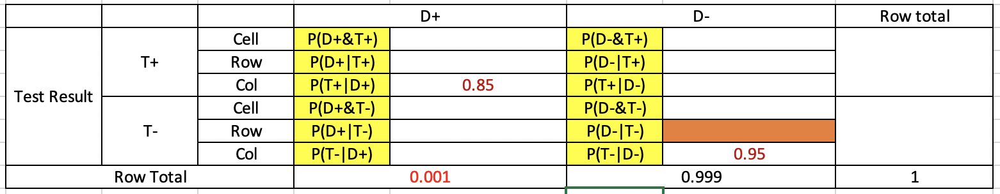

# P(D+\&T+) = P(D+) \* P(T+|D+)

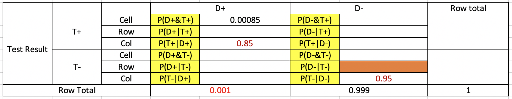

# P(D-\&T-) = P(D-) \* P(T-|D-)

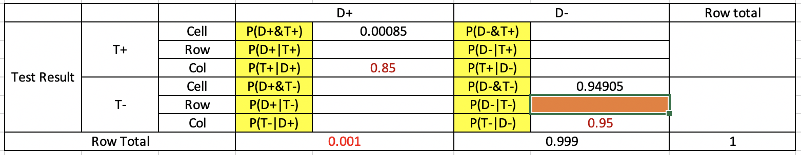

# P(D-\&T+) = P(D-) - P(D-\&T-)

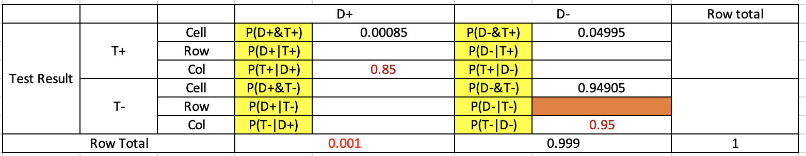

# P(T+) = P(D+\&T+) + P(D-\&T+)

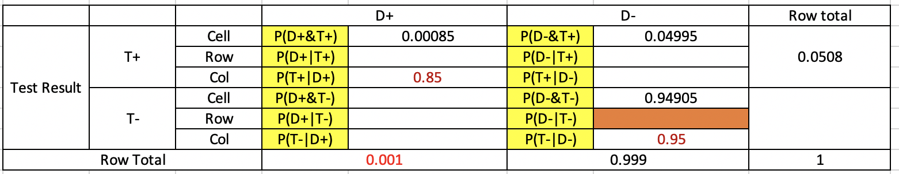

# P(T-) = 1 - P(T+)

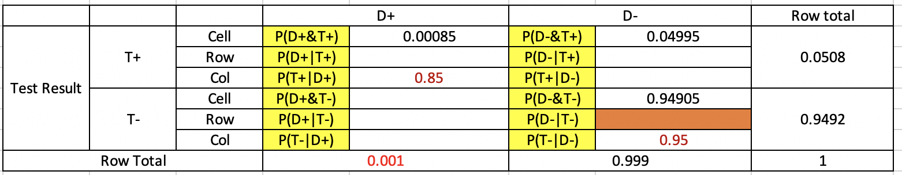

# P(D+\&T-) = P(T-) - P(D-\&T-)

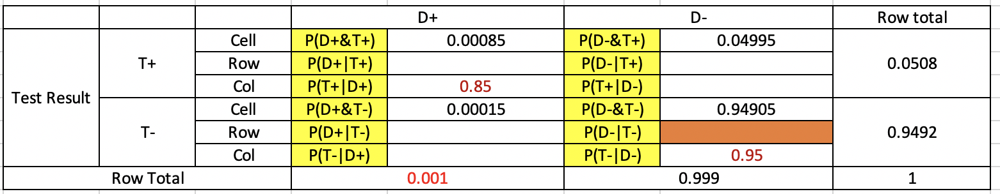

# Final table

|    |   D+    |   D-    |        |
| :-: | :-----: | :-----: | :----: |
| T+ | 0.00085 | 0.04995 | 0.0508 |
| T- | 0.00015 | 0.94905 | 0.9492 |
|    |  0.001  |  0.999  |   1    |

**B**. Calculate the **negative** predictive value of the test,
P(D-|T-).

``` r
# P(D-|T-) = P(D-&T-) / P(T-)
prob_t_minus = 0.9492 # P(T-)
prob_joint_d_minus_t_minus = 0.94905 # P(D-&T-)
prob_joint_d_minus_t_minus / prob_t_minus
```

    ## [1] 0.999842

**A** Create a plot that shows how the **positive** predictive value as
a function of the prevalence of disease, P(D+).

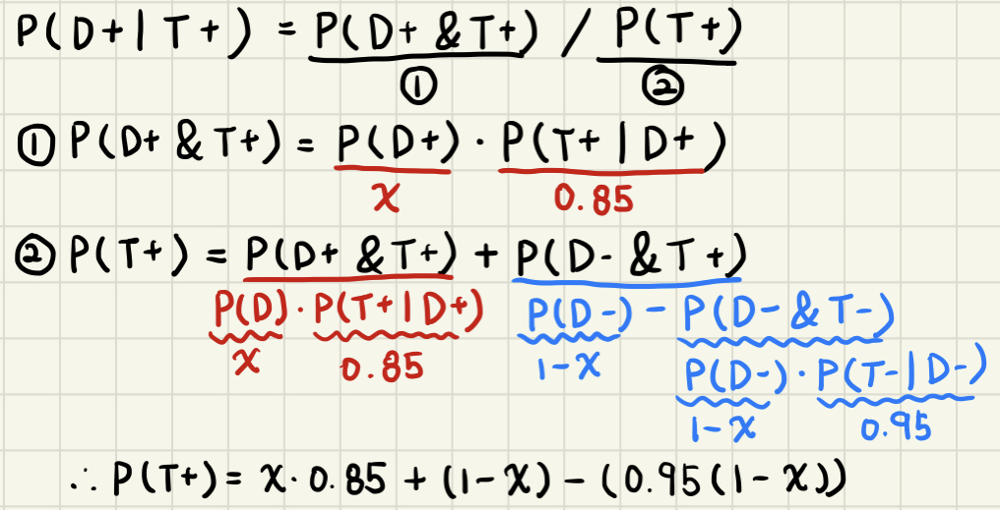

``` r
# Positive Predictive value, P(D+|T+)
# P(D+|T+) = P(D+&T+) / P(T+)

# simulation setting
prevalence <- seq(0, 1, length = 100)
ppv <- NA
test_positive <- NA
joint_test_positive_status_positive <- NA

# simulation
for (i in 1:length(prevalence)) {
  test_positive[i] <- (prevalence[i] * 0.85) + (1 - prevalence[i]) - (1 - prevalence[i])*(0.95) # P(T+) = P(D+&T+) + P(D-&T+), P(T+|D+) = .85, P(T-|D-) = .95
  joint_test_positive_status_positive[i] <- prevalence[i] * 0.85 # P(T+|D+) = .85
  ppv[i] = joint_test_positive_status_positive[i] / test_positive[i]
}

plot(prevalence, ppv, xlab = "Prevalence, P(D+)", ylab = "PPV", type = "l")
```

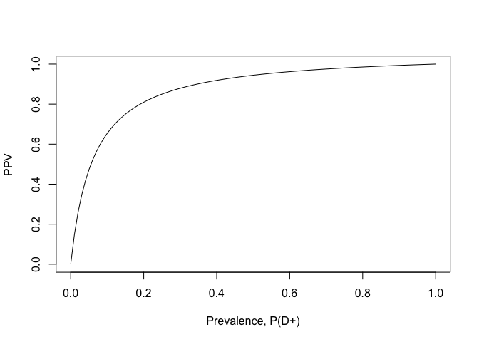<!-- -->

# 3\. Discrete Distributions

Suppose the yearly hospital charges (in thousands of dollars) for a
randomly selected Vanderbilt student is a mixture distribution.

For 50% of students, the hospital charges will be $0. For the remaining
50% of students, the hospital charges are a random variable described by
a gamma distribution with shape = 2 and scale = 2. (Again, in thousands
of dollars.)

``` r
hospital_charges <- function(N){
  group <- rbinom(N, 1, 0.5)
  charges <- 0*group + rgamma(N, shape = 2, scale = 2)*(1-group)
  charges
}
```

**C**. What is the 90th percentile for yearly hospital charges for a
randomly selected Vanderbilt student?

``` r
# Cumulative Distribution for thte yearly hospital charges (in thousands of dollars)
p_hospital_charges <- function(x) {
  .5 * punif(x,0,0) + .5*pgamma(x, shape = 2, scale = 2)
}

# Create the CDF for the yearly hospital charges
curve(p_hospital_charges(x), -10, 9, lwd = 3, ylim = c(0,1), xlim = c(0,10), ylab = "probability", main = "CDF for the yearly hospital charges")
```

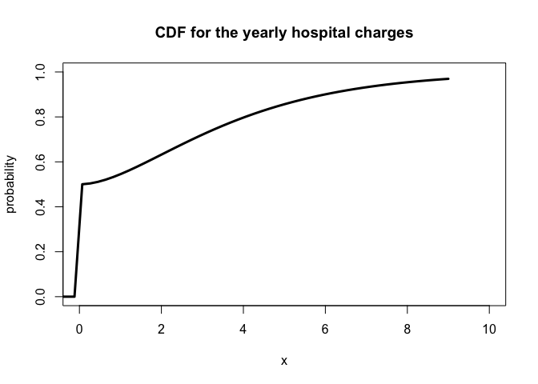<!-- -->

``` r
# 1. Analytical approach - Uniroot
h <- function(x){p_hospital_charges(x) - 0.9}
uniroot(h, lower = -10, upper = 10)
```

    ## $root
    ## [1] 5.988596
    ## 
    ## $f.root
    ## [1] -7.672511e-07
    ## 
    ## $iter
    ## [1] 10
    ## 
    ## $init.it
    ## [1] NA
    ## 
    ## $estim.prec
    ## [1] 6.103516e-05

``` r
#5.988596
```

``` r
# 2. Analytical approach (2) - table look-up method
x_range <- seq(5.97, 6, by=0.00005)
head(data.frame(x = x_range, p = p_hospital_charges(x_range)))
```

    ##         x         p
    ## 1 5.97000 0.8993000
    ## 2 5.97005 0.8993019
    ## 3 5.97010 0.8993038
    ## 4 5.97015 0.8993057
    ## 5 5.97020 0.8993076
    ## 6 5.97025 0.8993095

``` r
# 5.98865
```

``` r
# 3) Simulation way
out <- NA
N <- 100000
for (i in 1:N) {
  out[i] <- hospital_charges(1)
}

quantile(out, 0.9)
```

    ##      90% 
    ## 6.022068

**B**. Consider the **class** average yearly hospital charge for the
students in a class of size 30. Plot the density function or a simulated
histogram of the class average yearly hospital charge.

``` r
# simulation setting
out <- NA
N <- 10000 # The number of simulation

# simulation
for (i in 1:N) {
  out[i] <- hospital_charges(30) %>% mean
}

# Create a plot
hist(out, breaks = 100, main = "Simulated histogram of the class average yearly hospital charge", xlab = "The class(30) average yearly hospital charge")
```

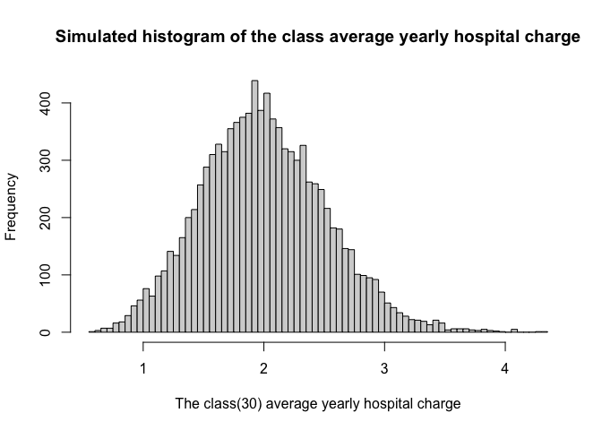<!-- -->

**A**. What is the probability that a randomly selected class of size 30
students will have less than 10 students with zero yearly hospital
charges?

``` r
# simulation setting
out <- NA
N <- 100000 # the number of simulation

# simulation 
for (i in 1:N) {
  zero_student <- sum(hospital_charges(30) == 0) # How many students are with zero yearly hospital charges?
  out[i] <- ifelse(zero_student < 10, 1, 0) # Count when less than 10 students have zero charges
}
mean(out)
```

    ## [1] 0.02135

# 4\. Continuous Distributions

**C.** Suppose diastolic blood pressure (DBP) follows a normal
distribution with mean 80 mmHg and SD 15 mmHg. What is the probability
that a randomly sampled person’s DBP lies between 70 and 104 mmHg?

``` r
pnorm(104, mean = 80, sd = 15) - pnorm(70, mean = 80, sd = 15)
```

    ## [1] 0.6927082

``` r
# Then answer is 0.6927082
```

**B.** Suppose a human femur was discovered that is 37 cm long. Also
suppose that using the NHANES data, researchers believe the distribution
of femor bones, by sex, are distributed as follows:

  - Female adult femor \(\sim N(36, 3.3)\)
  - Male adult femor \(\sim N(40, 3.4)\)

Under the assumption that male and females are equally likely, what is
the probability that the discovered femor was from a male?

``` r
# P(male | 37cm)
prob_row_37 <- dnorm(37, 36, 3.3) * 0.5 + dnorm(37, 40, 3.4) * 0.5 # P(37cm)
prob_joint_male_37 <- dnorm(37, 40, 3.4) * 0.5 # P(Male&37cm)
prob_conditional_male_37 <- prob_joint_male_37 / prob_row_37 # P(male | 37cm) = P(Male&37cm)/P(37cm)
prob_conditional_male_37
```

    ## [1] 0.407765

**A.** Continuing part **B**, generate a plot of P(femor from male |
femor length = x). Let femor length range from 25 to 50.

``` r
# Simulation Setting
femor_length <- 25:50
prob_male <- 0.5
prob_row_length = NA
prob_joint_male_length = NA
prob_conditional_male_length = NA

# Simulation
for (i in seq_along(femor_length)) {
  prob_row_length[i] <- dnorm(femor_length[i], 40, 3.4)*prob_male + # P(length=X)
    dnorm(femor_length[i], 36, 3.3)*(1-prob_male)
  prob_joint_male_length[i] <- dnorm(femor_length[i], mean = 40, sd = 3.4) * prob_male # P(Male&length=X)
  prob_conditional_male_length[i] <- prob_joint_male_length[i] / prob_row_length[i] # P(M|length=X)
} #P(M|length = X) = P(M & length=X) / P(length=X)

# Create a plot
plot(femor_length, prob_conditional_male_length, type = "l", main = "P( Male | femor length) by femor length",xlab = "Femor Length", ylab = "P( Male | femor length)")
```

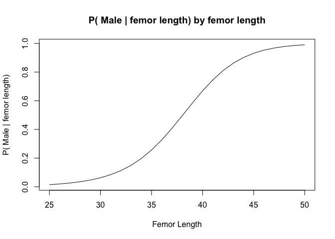<!-- -->

# 5\. Expectation and Variance

Let us revisit the yearly hospital charges distribution from a previous
section.

> **Recall:** The yearly hospital charges (in thousands of dollars) for
> a randomly selected Vanderbilt student is a mixture distribution. For
> 50% of students, the hospital charges will be $0. For the remaining
> 50% of students, the hospital charges are a random variable described
> by a gamma distribution with shape = 2 and scale = 2. (Again, in
> thousands of dollars.)

``` r
hospital_charges <- function(N){
  group <- rbinom(N, 1, 0.5)
  charges <- 0*group + rgamma(N, shape = 2, scale = 2)*(1-group)
  charges
}
```

**C.** What is E\[yearly hospital charges\]?

``` r
# Simulation Setting
out <- NA
N <- 100000

# Simulation
for (i in 1:N) {
  out[i] <- hospital_charges(1)
}

# Calculate the mean
mean(out)
```

    ## [1] 2.005713

**B.** Suppose Vanderbilt implements a cap of $10,000 on yearly student
hospital charges. What is the mean yearly hospital charge under the new
policy?

``` r
# Simulation setting
out <- NA
N <- 10000

# Simulation
for (i in 1:N) {
  a <- hospital_charges(1)
  if(a <= 10) { # if a charge is over 10, do not involve it
    out[i] <- a
  }
}

mean(out, na.rm = TRUE)
```

    ## [1] 1.804355

**A.** What is the variance of yearly hospital charge under the new
policy?

``` r
# Simulation setting
out <- NA
N <- 10000

# Simulation
for (i in 1:N) {
  a <- hospital_charges(1)
  if(a <= 10) { # if a charge is over 10, do not involve it
    out[i] <- a 
  }
}

var(out, na.rm = TRUE)
```

    ## [1] 5.746358

# 6\. Transformations & Sampling Distributions

**C.** Consider the log normal distribution. If X is a log normal random
variable, then log(X) is a normal random variable. One way to create
pseudo-random draws from the log normal distribution is to generate
draws from a normal distribution and then to transform the draws by
expononentiating. The parameters of the log normal distribution are the
parameters of the underlying normal distribution, \(\mu\) and \(\sigma\)
(or \(\sigma^2\)).

Log normal data are prevalent is biological systems and econometrics.

Suppose a blood chemistry measure has a log normal distribution with
\(\mu\) = 0 and \(\sigma\) = 1. Generate an histogram or density curve
for the sampling distribution of the median when the sample size is 101.

``` r
# Simulation setting
n = 5000
meds = NA

# Sampling distribution of median
for(i in 1:n) {
  sample <- exp(rnorm(101, mean = 0, sd = 1))
  meds[i] <- median(sample)
}

# Create a desity plot
hist(meds, main = "Histogram for the sampling distribution of the median")
```

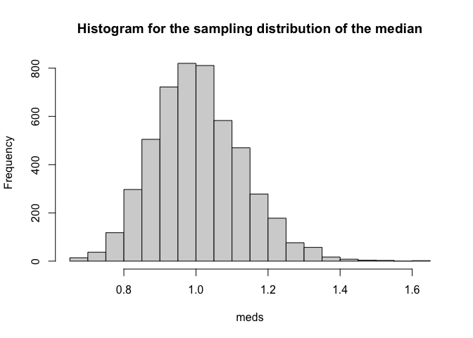<!-- -->

**B.** Below is the CDF function for the kth order statistic when the
underlying distribution is log normal with \(\mu\) = 0 and \(\sigma\) =
1. Create a plot of the ECDF of the simulated sampling distribution
generated in **C** and overlay the CDF using the function below.

``` r
# CDF function for the Kth order statistic
Fk <- function(x,k,n){
  pbinom(k-1, n, plnorm(x), lower.tail = FALSE)
}

# Create a plot of the ECDF of C
plot(ecdf(meds), main = "ECDF and CDF of the Median", ylab = "Probability", xlab = "Median")
curve(Fk(x, k = 51, n = 101), add = TRUE, col = "red")
legend("topleft", c("ECDF", "CDF"), col = c(1,2), lwd = 3, bty = "n")
```

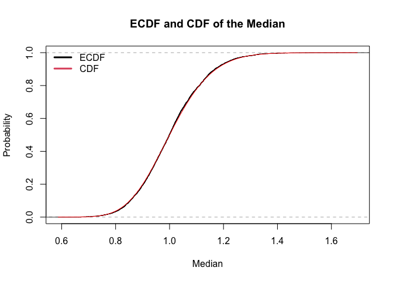<!-- -->

**A.** Of the 25th, 50th, and 75th quantiles of the distribution from
**B**, which will have the tigthest 95% CI? (Show the sampling
distribution of each.)

``` r
# Simulation setting
n = 5000
quantile.25 = NA
quantile.50 = NA
quantile.75 = NA

for(i in 1:n) {
  sample <- exp(rnorm(101, mean = 0, sd = 1))
  quantile.25[i] <- quantile(sample, 0.25)
  quantile.50[i] <- quantile(sample, 0.50)
  quantile.75[i] <- quantile(sample, 0.75)
}

# Calculate 95% CI for 25th, 50th, 75th quantiles of sampling distribution
ci.25 <- quantile(quantile.25, c(0.025, 0.975))
ci.50 <- quantile(quantile.50, c(0.025, 0.975))
ci.75 <- quantile(quantile.75, c(0.025, 0.975))

# Calculate the length of each 95% CI
tight.25 <- ci.25[2] - ci.25[1]
tight.50 <- ci.50[2] - ci.50[1]
tight.75 <- ci.75[2] - ci.75[1]

tight.25
```

    ##     97.5% 
    ## 0.2749577

``` r
tight.50
```

    ##     97.5% 
    ## 0.4912835

``` r
tight.75
```

    ##    97.5% 
    ## 1.064436

``` r
# Which has the tightest 95% CI?
min(tight.25, tight.50, tight.75)
```

    ## [1] 0.2749577

``` r
# Draw density plots
par(mfrow = c(1,3))
plot(density(quantile.25), main = "25th quantile", xlab = "x")
plot(density(quantile.50), main = "50th quantile", xlab = "x")
plot(density(quantile.75), main = "75th quantile", xlab = "x")
```

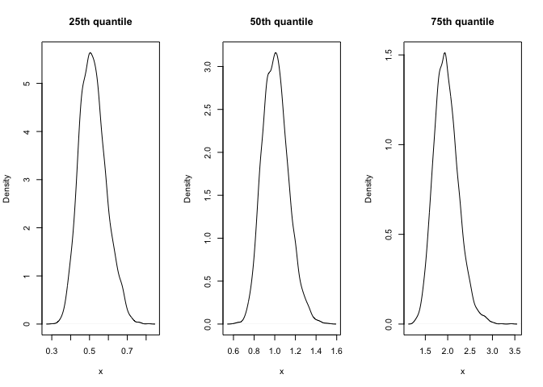<!-- -->

``` r
# 25th quantiles of the sampling distribution has the tightest 95% CI.
```

# 7\. Estimation of CDF and PDF from data

The following code will load the NHANES data and select the first 500
rows.

``` r
Hmisc::getHdata(nhgh)
d1 <- nhgh[1:500,]
```

**C.** Estimate the distribution of standing height for adult (age \>
18) males using the MLE method with a normal distribution. Create a plot
of the estimated density function.

``` r
# Making a subset for adult males's standing height
adult.male.ht <- d1 %>% filter(age > 18) %>% 
  filter(sex == "male") %>% 
  filter(!is.na(ht)) %>% `[[`("ht")

# Estimation of parameters
normal.mean <- mean(adult.male.ht)
normal.sd <- sd(adult.male.ht)

normal.mean
```

    ## [1] 174.327

``` r
normal.sd
```

    ## [1] 7.56826

``` r
# Log Likelihood function
nll <- function(mean, sd) {
  fs <- dnorm(x = adult.male.ht, mean = mean, sd = sd, log = TRUE)
  -sum(fs)
}

# Find mean and standard deviation which returns the highest likelihood 
fit_norm <- mle(
  nll,
  start = list(mean = normal.mean, sd = normal.sd),
  method = "L-BFGS-B",
  lower = c(0, 0.01)
)

coef(fit_norm)
```

    ##       mean         sd 
    ## 174.327014   7.550303

``` r
# Create a density plot
curve(dnorm(x, mean = coef(fit_norm)[1], sd = coef(fit_norm)[2]), lwd = 3, xlim = c(150, 200), ylab = "Density", xlab = "Male Adults' Standing Height")
```

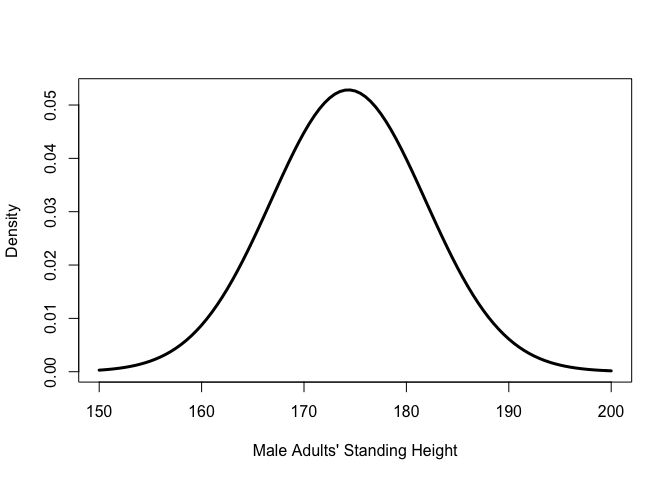<!-- -->

**B.** Estimate the distribution of BMI for adult (age \> 18) females
using using the method of moment method with the gamma distribution.
Create a plot of the estimated density function.

``` r
# Make a subset for female adult's BMI
adult.female.bmi <- d1 %>% filter(age > 18) %>% 
  filter(sex == "female") %>% 
  filter(!is.na(bmi)) %>% `[[`("bmi")

# Estimation of parameters.
mm.gam.shape <- mean(adult.female.bmi)^2 / var(adult.female.bmi)
mm.gam.scale <- var(adult.female.bmi) / mean(adult.female.bmi)

curve(dgamma(x, shape = mm.gam.shape, scale = mm.gam.scale), lwd = 3, xlim = c(0,60), ylab = "Density", xlab = "Female Adult's BMI")
```

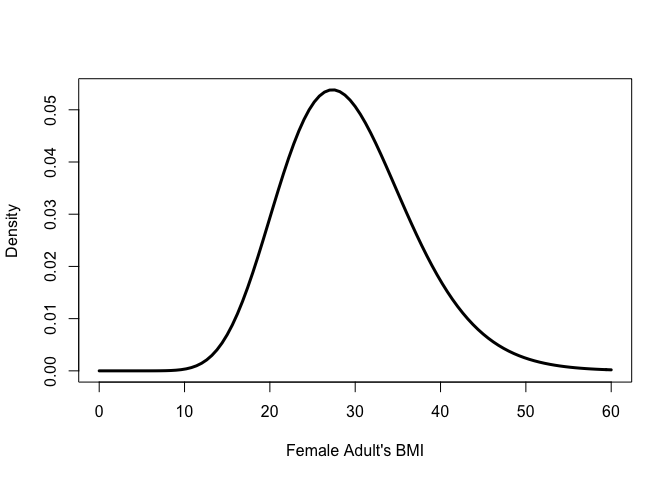<!-- -->

**A.** Estimate the distribution of creatinine (SCr) for adults (age \>
18) using the kernel density method with a gaussian kernel. Create a
plot of the estimated density function.

``` r
# Make a subset for adult's Scr
adult.scr <- d1 %>% filter(age > 18) %>% 
  filter(!is.na(SCr)) %>% `[[`("SCr")
N.adult.scr <- length(adult.scr)

# Kernel density method
epdfstar <- function(t, data, smooth) {
  outer(t, data, function(a,b){dnorm(a,b,smooth)}) %>% rowMeans
}

# Create a density plot
curve(epdfstar(x, adult.scr, smooth = 1), lwd = 3, xlim = c(-5,5), ylab = "Density", xlab = "Adult's Creatinine(SCr)")
```

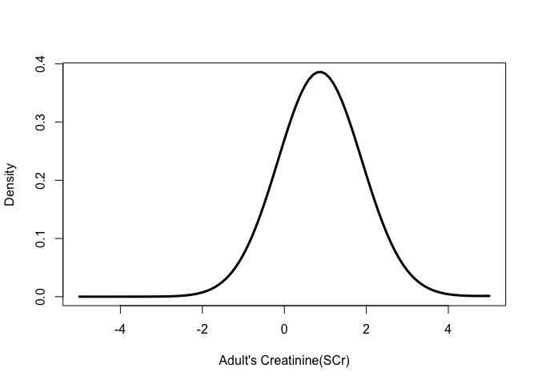<!-- -->

``` r
plot(density(adult.scr))
```

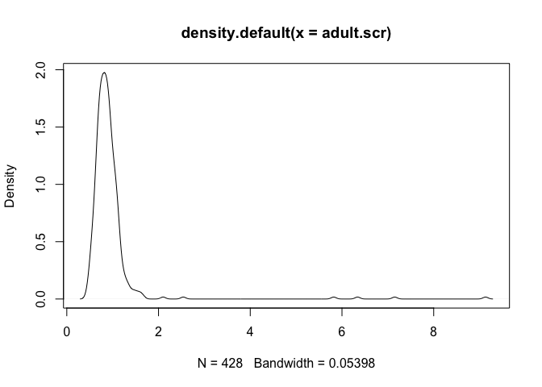<!-- -->

``` r
hist(adult.scr, breaks = 100)
```

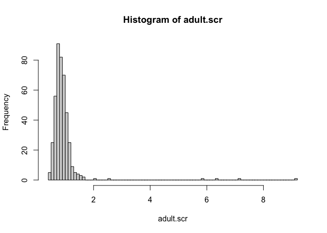<!-- -->

# 8\. Sample from an estimated distribution

The following code will load the low birth weight data from the MASS
package. The description of the variables in the dataset can be found in
the birthwt documentation with the command `?MASS::birthwt`.

``` r
bwt <- MASS::birthwt
```

**C.** Generate a 95% confidence interval for the mean birthweight of
infants whose mothers **did** smoke during pregnancy using the
bootstrap.

``` r
# Make a subset for smoking group's birthweight
bwt.smoker <- bwt %>% filter(smoke == 1) %>% 
  filter(!is.na(bwt)) %>% `[[`("bwt")

n_bwt.smoker <- length(bwt.smoker) # Sample Size
M <- 5000
out <- rep(NA, M)

for(i in 1:M) {
  index <- sample.int(n_bwt.smoker, n_bwt.smoker, replace = TRUE)
  out[i] <- bwt.smoker[index] %>% mean
}

quantile(out, c(0.025, 0.975))
```

    ##     2.5%    97.5% 
    ## 2619.209 2917.828

**B.** Generate a 95% confidence interval for the mean birthweight of
infants whose mothers **did** smoke during pregnancy using the Central
Limit Theorem shortcut.

``` r
# With CLT shortcut
t1 <- t.test(bwt.smoker)
t1
```

    ## 
    ##  One Sample t-test
    ## 
    ## data:  bwt.smoker
    ## t = 36.149, df = 73, p-value < 2.2e-16
    ## alternative hypothesis: true mean is not equal to 0
    ## 95 percent confidence interval:
    ##  2619.094 2924.744
    ## sample estimates:
    ## mean of x 
    ##  2771.919

``` r
# 95% CI: (2619.094, 2924.744)
```

**A.** Let \(\mu_s\) be the mean birthweight of infants whose mothers
smoked during pregnancy. Let \(\mu_{ns}\) be the mean for the
non-smoking group. Use simulation to calculate the 95% confidence
interval for \(\mu_s/\mu_{ns}\).

``` r
# Make a subset for non-smoking group's birthweight
bwt.non.smoker <- bwt %>% filter(smoke == 0) %>% 
  filter(!is.na(bwt)) %>% `[[`("bwt")

# Simulation Setting
R <- 5000 # The number of simulation
mu.s <- rep(NA, R)
mu.ns <- rep(NA, R)
result <- rep(NA, R)

# MLE for smoker group
mean.mle_mu.s <- mean(bwt.smoker)
sd.mle_mu.s <- sd(bwt.smoker)

# MLE for non-smoker group
mean.mle_mu.ns <- mean(bwt.non.smoker)
sd.mle_mu.ns <- sd(bwt.non.smoker)

# Simulation
for(i in 1:R) {
  s <- rnorm(length(bwt.smoker), mean = mean.mle_mu.s, sd = sd.mle_mu.s)
  mu.s[i] <- mean(s)
  ns <- rnorm(length(bwt.non.smoker), mean = mean.mle_mu.ns, sd = sd.mle_mu.ns)
  mu.ns[i] <- mean(ns)
  result[i] <- mu.s[i]/mu.ns[i]
}

quantile(result, c(0.025, 0.975))
```

    ##      2.5%     97.5% 
    ## 0.8455178 0.9731191

# 9\. Inference

**C.** Suppose two studies were performed looking at the risk of mild
complication after hernia repair using open and laparoscopic surgical
approaches. The study results are below. Using the data from each study
individually, perform the hypothesis test that the risk of complication
between open and laparoscopic repairs are the same under the usual point
null. What is the p-value from each study? What do you conclude from
each study?

| Study 1 | Comp | No comp |
| :------ | :--- | :------ |
| Open    | 30   | 70      |
| Lap     | 35   | 65      |

| Study 2 | Comp | No comp |
| :------ | :--- | :------ |
| Open    | 600  | 1400    |
| Lap     | 619  | 1381    |

``` r
#CLT: Random, normal, independent
# H0: The risk of complication between open and laparoscopic repairs are same. (NO difference)
# H1: The risk of complication between open and laparoscopic repairs are different.
# alpha = 0.05

# Study 1
prop.test(c(30,35), c(100, 100))
```

    ## 
    ##  2-sample test for equality of proportions with continuity correction
    ## 
    ## data:  c(30, 35) out of c(100, 100)
    ## X-squared = 0.36467, df = 1, p-value = 0.5459
    ## alternative hypothesis: two.sided
    ## 95 percent confidence interval:
    ##  -0.18963943  0.08963943
    ## sample estimates:
    ## prop 1 prop 2 
    ##   0.30   0.35

``` r
# p-value = 0.5459
# The 95% confidence interval is (-18.9, 8.9). Since the CI covers the point null 0, we failed to reject the null hypothesis. (Inconclusive - We identified neither similarity nor difference)


# Study 2
prop.test(c(600, 619), c(2000, 2000))
```

    ## 
    ##  2-sample test for equality of proportions with continuity correction
    ## 
    ## data:  c(600, 619) out of c(2000, 2000)
    ## X-squared = 0.3823, df = 1, p-value = 0.5364
    ## alternative hypothesis: two.sided
    ## 95 percent confidence interval:
    ##  -0.03852774  0.01952774
    ## sample estimates:
    ## prop 1 prop 2 
    ## 0.3000 0.3095

``` r
# p-value = 0.5364
# The 95% confidence interval is (-3.8, 1.9). Since the CI covers the point null 0, we failed to reject the null hypothesis. (Inconclusive - We identified neither similarity nor difference)
```

**B.** Suppose that prior to the studies, the researchers established an
equivalence threshold of 6 percentage points. Using the confidence
intervals, which studies (if any) showed a conclusive similarity between
surgical approaches for the complication rate. Explain why.

``` r
# Study 1's confidence interval: (-18.9, 8.9)
# Study 2's confidence interval: (-3.8, 1.9)
# Since the study 2's confidence interval is covered by the equivalence threshold of 6pp, study 2 showed a conclusive similarity between surgical approaches for the complication rate.
```

**A.** If the data from the studies were combined, what is the smallest
equivalence threshold that would identify a conclusive similarity
between the surgical approaches?

| data | Comp | No comp |
| :--- | :--- | :------ |
| Open | 630  | 1470    |
| Lap  | 654  | 1446    |

``` r
prop.test(c(630, 654), c(2100,2100))
```

    ## 
    ##  2-sample test for equality of proportions with continuity correction
    ## 
    ## data:  c(630, 654) out of c(2100, 2100)
    ## X-squared = 0.59341, df = 1, p-value = 0.4411
    ## alternative hypothesis: two.sided
    ## 95 percent confidence interval:
    ##  -0.03976899  0.01691185
    ## sample estimates:
    ##    prop 1    prop 2 
    ## 0.3000000 0.3114286

``` r
# 3.976899 percentage points is the smallest equivalence threshold that would identify a conclusive similarity between the surgical approaches
```

# 10\. Joint Distributions

**C.** Fill in the blank. The sample correlation is a measure of
\_\_\_\_\_\_\_\_\_\_\_\_\_\_\_\_\_ association.

``` r
# linear
```

**B.** Explain why predictions from a conditional distribution generally
have smaller prediction error than predictions from the marginal
distribution.

``` r
# Since conditional distribution has more information, it is more tighter than the marginal distribution. This cause smaller prediction error.
```

**A.** Use the CLT shortcut to calculate the 95% confidence interval for
the correlation of arm circumference and arm length using the NHANES
dataset. Is the sample correlation a reasonable measure of association
for this data?

``` r
Hmisc::getHdata(nhgh)
cor.test(nhgh$armc, nhgh$arml)
```

    ## 
    ##  Pearson's product-moment correlation
    ## 
    ## data:  nhgh$armc and nhgh$arml
    ## t = 46.838, df = 6601, p-value < 2.2e-16
    ## alternative hypothesis: true correlation is not equal to 0
    ## 95 percent confidence interval:
    ##  0.4811147 0.5173282
    ## sample estimates:
    ##       cor 
    ## 0.4994396

1.The 95% confidence interval for the correlation of arm circumference
and arm length: (0.481, 0.517)

2.  Since the p-value is 2.2e-16, which is very small, we have a lot of
    confidence in the trend. However, the correlation coefficient, which
    is 0.499, does not indicate strong linear relationship. Therefore,
    it is difficult to say that the sample correlation is a “reasonable”
    measure of association for this data.
