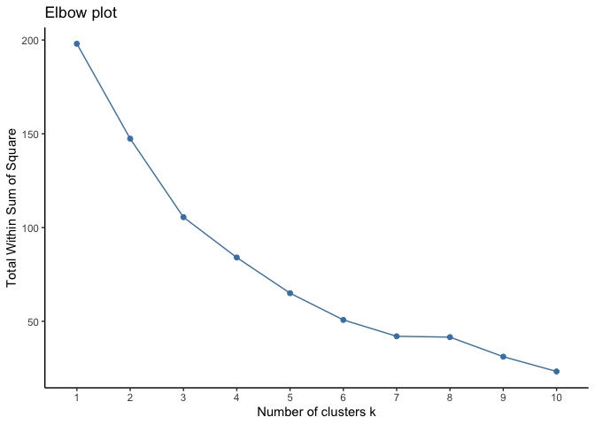
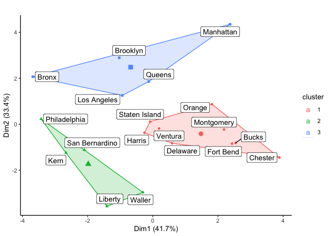
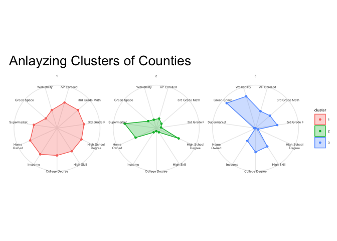

K-means Clustering
================

``` r
library(tidyverse)
```

    ## ── Attaching packages ─────────────────────────────────────── tidyverse 1.3.0 ──

    ## ✓ ggplot2 3.3.2     ✓ purrr   0.3.4
    ## ✓ tibble  3.0.4     ✓ dplyr   1.0.2
    ## ✓ tidyr   1.1.2     ✓ stringr 1.4.0
    ## ✓ readr   1.3.1     ✓ forcats 0.5.0

    ## ── Conflicts ────────────────────────────────────────── tidyverse_conflicts() ──
    ## x dplyr::filter() masks stats::filter()
    ## x dplyr::lag()    masks stats::lag()

``` r
library(viridis)
```

    ## Loading required package: viridisLite

``` r
library(factoextra)
```

    ## Welcome! Want to learn more? See two factoextra-related books at https://goo.gl/ve3WBa

``` r
library(data.table)
```

    ## 
    ## Attaching package: 'data.table'

    ## The following objects are masked from 'package:dplyr':
    ## 
    ##     between, first, last

    ## The following object is masked from 'package:purrr':
    ## 
    ##     transpose

``` r
library(ggradar)
library(ggiraphExtra)
library(ggrepel)
options(scipen = 999)
```

# Data import

``` r
# Import data
df <- read_csv("~/Vanderbilt University/eda20-team5-project/data.csv")
```

# Basic Exporlation

``` r
is.data.frame(df)
```

    ## [1] TRUE

``` r
dim(df)
```

    ## [1] 146112     39

``` r
head(df)
```

    ## # A tibble: 6 x 39
    ##   `_id` geoid  year in100 msaid15 msaname15 countyfips statefips stateusps   pop
    ##   <dbl> <chr> <dbl> <dbl>   <dbl> <chr>     <chr>      <chr>     <chr>     <dbl>
    ## 1     1 0100…  2010     0   33860 Montgome… 01001      01        AL          424
    ## 2     2 0100…  2015     0   33860 Montgome… 01001      01        AL          414
    ## 3     3 0100…  2010     0   33860 Montgome… 01001      01        AL          497
    ## 4     4 0100…  2015     0   33860 Montgome… 01001      01        AL          508
    ## 5     5 0100…  2010     0   33860 Montgome… 01001      01        AL          878
    ## 6     6 0100…  2015     0   33860 Montgome… 01001      01        AL          804
    ## # … with 29 more variables: ED_APENR <dbl>, ED_ATTAIN <dbl>, ED_COLLEGE <dbl>,
    ## #   ED_ECENROL <dbl>, ED_HSGRAD <dbl>, ED_MATH <dbl>, ED_READING <dbl>,
    ## #   ED_SCHPOV <dbl>, ED_TEACHXP <dbl>, ED_PRXECE <dbl>, ED_PRXHQECE <dbl>,
    ## #   HE_FOOD <dbl>, HE_GREEN <dbl>, HE_HEAT <dbl>, HE_HLTHINS <dbl>,
    ## #   HE_OZONE <dbl>, HE_PM25 <dbl>, HE_VACANCY <dbl>, HE_WALK <dbl>,
    ## #   HE_SUPRFND <dbl>, HE_RSEI <dbl>, SE_POVRATE <dbl>, SE_PUBLIC <dbl>,
    ## #   SE_HOME <dbl>, SE_OCC <dbl>, SE_MHE <dbl>, SE_EMPRAT <dbl>,
    ## #   SE_JOBPROX <dbl>, SE_SINGLE <dbl>

This data is about child opportunity index in United States. It has
146112 rows and 39 columns. The unit of analysis is town and each row
shows a town’s properties related to child education in 2010 and 2015.
The shape of data is long and the class of data is dataframe.

# Data Cleaning

## 1\. Column names

Since there are so many observations in the data, we are going to focus
on a specific state, Tennessee.

``` r
# Separate the column "msaname15" into "city", "state", "size" and "no_mean"
df <- df %>% 
  separate(msaname15, c("city", "state", "size", "no_mean"), sep = " ")
```

According to the data dictionary, the unit of the 4
columns(“ED\_PRXECE”, “ED\_PRXHQECE”, “HE\_SUPRFND”, “HE\_RSEI”) in
the data is natural log. Natural log units change values less than
e(2.71828) into negative numbers and this makes analysis difficult.
Therefore, we are going to change the value of these 4 columns into
original unit by using exp function.

``` r
df<- df %>% 
  mutate(num_edu_center = exp(ED_PRXECE)) %>%
  mutate(num_good_edu_center = exp(ED_PRXHQECE)) %>%
  mutate(num_waste_dump_site = exp(HE_SUPRFND)) %>%
  mutate(population = exp(HE_RSEI)) %>%
  select(-ED_PRXECE, -ED_PRXHQECE, -HE_SUPRFND, -HE_RSEI)
```

Most of the columns are hard to understand. We tried to make it easier
and obvious even without the data dictionary.

``` r
df <- df %>% 
  rename(id = `_id`) %>% 
  rename(geo_id = geoid) %>% 
  rename(metro_areas = in100) %>%
  rename(area_code = msaid15) %>% 
  rename(county_code = countyfips) %>%
  rename(num_under_18 = pop) %>% 
  rename(AP_students = ED_APENR) %>%
  rename(college_deg = ED_ATTAIN) %>%
  rename(num_college_enrolled = ED_COLLEGE) %>%
  rename(preschoolers = ED_ECENROL) %>%
  rename(hs_grads = ED_HSGRAD) %>%
  rename(third_g_math = ED_MATH) %>%
  rename(third_g_read = ED_READING) %>%
  rename(elementary_school_poverty = ED_SCHPOV) %>% 
  rename(firstsecond_y_teachers =ED_TEACHXP) %>% 
  rename(supermarket_nearby = HE_FOOD) %>% 
  rename(green_spaces = HE_GREEN) %>%
  rename(days_temp_above90 = HE_HEAT) %>%
  rename(phealth_insurance = HE_HLTHINS) %>%
  rename(mean_ozone_amount = HE_OZONE) %>%
  rename(mean_microparticle = HE_PM25) %>%
  rename(housing_vacancy = HE_VACANCY) %>%
  rename(walkability = HE_WALK) %>% 
  rename(below100_poverty = SE_POVRATE) %>%
  rename(public_assistance = SE_PUBLIC) %>%
  rename(home_ownership = SE_HOME) %>%
  rename(perc_over15_high_skill = SE_OCC) %>%
  rename(median_income=SE_MHE) %>%
  rename(employment_rate = SE_EMPRAT) %>%
  rename(commute_over1hour = SE_JOBPROX) %>%
  rename(single_parents = SE_SINGLE)
```

Deleted unnecessary columns (They have the same values.)

``` r
df <- df %>% select(-state, -no_mean, -statefips, -num_waste_dump_site)
```

## 2\. Dealing with NA values.

Creates a new dataframe that gives us a count of the na’s in each
variable column.

``` r
extra_NA<- df %>% 
  select_if(function(x) any(is.na(x))) %>% 
  summarise_each(funs(sum(is.na(.))))
```

In order to decide how to deal with NA values, we made a subset which
has the rows containing NA values to see their properties.

``` r
NA_subset <- df[rowSums(is.na(df)) > 0, ]
```

Some rows have more NAs than meaningful values. For these rows, due to
the potential of providing misleading results for analysis, they were
deleted from the dataset.

``` r
# Delete some rows having more NAs than meaningful values.
df <- df %>% filter((geo_id != 47155980100) & (geo_id != 47145980100) & (geo_id != 47031980100) & (geo_id != 47029980100) & (geo_id != 47009980200) & (geo_id != 47009980100) & (geo_id != 47001980100) & (geo_id != 47037980100) & (geo_id != 47037980200) & (geo_id != 47037013000))
```

## 3\. Replace county codes into county names

``` r
df <- df %>%
  #NYC
  mutate(county_code = replace(county_code, county_code == '36061', 'Manhattan')) %>% 
  mutate(county_code = replace(county_code, county_code == '36047', 'Brooklyn')) %>%
  mutate(county_code = replace(county_code, county_code == '36081', 'Queens')) %>%
  mutate(county_code = replace(county_code, county_code == '36005', 'Bronx')) %>%
  mutate(county_code = replace(county_code, county_code == '36085', 'Staten Island'))%>%
  #Philly
  mutate(county_code = replace(county_code, county_code == '42017', 'Bucks')) %>%
  mutate(county_code = replace(county_code, county_code == '42029', 'Chester')) %>%
  mutate(county_code = replace(county_code, county_code == '42045', 'Delaware')) %>%
  mutate(county_code = replace(county_code, county_code == '42091', 'Montgomery')) %>%
  mutate(county_code = replace(county_code, county_code == '42101', 'Philadelphia')) %>% 
  #Houston
  mutate(county_code = replace(county_code, county_code == "48201", "Harris")) %>%
  mutate(county_code = replace(county_code, county_code == "48157", "Fort Bend")) %>%
  mutate(county_code = replace(county_code, county_code == "48339", "Montgomery")) %>%
  mutate(county_code = replace(county_code, county_code == "48167", "Galveston")) %>%
  mutate(county_code = replace(county_code, county_code == "48039", "Brazoria")) %>% 
  mutate(county_code = replace(county_code, county_code == "48291", "Liberty")) %>% 
  mutate(county_code = replace(county_code, county_code == "48473", "Waller")) %>%
  mutate(county_code = replace(county_code, county_code == "48071", "Chambers"))%>%
  #LA
  mutate(county_code = replace(county_code,county_code == "06111", "Ventura")) %>%
  mutate(county_code = replace(county_code, county_code == "06059","Orange"))%>%
  mutate(county_code = replace(county_code, county_code == "06071","San Bernardino"))%>%
  mutate(county_code = replace(county_code,county_code == "06037", "Los Angeles"))%>%
  mutate(county_code = replace(county_code,county_code == "06029", "Kern"))%>%
  mutate_all(~ifelse(is.na(.x), mean(.x, na.rm = TRUE), .x))
```

    ## Warning: Problem with `mutate()` input `city`.
    ## ℹ argument is not numeric or logical: returning NA
    ## ℹ Input `city` is `(structure(function (..., .x = ..1, .y = ..2, . = ..1) ...`.

    ## Warning in mean.default(.x, na.rm = TRUE): argument is not numeric or logical:
    ## returning NA

    ## Warning: Problem with `mutate()` input `size`.
    ## ℹ argument is not numeric or logical: returning NA
    ## ℹ Input `size` is `(structure(function (..., .x = ..1, .y = ..2, . = ..1) ...`.

    ## Warning in mean.default(.x, na.rm = TRUE): argument is not numeric or logical:
    ## returning NA

``` r
Cities <-
  df %>% filter(
    county_code == 'Manhattan'|
    county_code == 'Brooklyn'|
    county_code == 'Queens'|
    county_code == 'Bronx'|
    county_code == 'Staten Island'|
    county_code == 'Bucks'|
    county_code == 'Chester'|
    county_code == 'Delaware'|
    county_code == 'Montgomery'|
    county_code == 'Philadelphia'|
    county_code == 'Harris'|
    county_code == 'Montgomery'|
    county_code == 'Fort Bend'|
    county_code == 'Liberty'|
    county_code == 'Waller'|
    county_code == 'Ventura'|
    county_code == 'Orange'|
    county_code == 'San Bernardino'|
    county_code == 'Kern'|
    county_code == 'Los Angeles'
  ) %>% na.omit()

income <-Cities %>% select(median_income) %>% summarise(mean = mean(median_income))
text_color <- c('red','black','black','black','black','black','black')
```

# Machine Learning - clustering

Clustering is a broad set of techniques for finding subgroups of
observations within a data set. When we cluster observations, we want
observations in the same group to be similar and observations in
different groups to be dissimilar.

Among variables in the dataset, choose some which have numerical values.

``` r
Cities_2015 <- Cities %>% filter(year == 2015)
Cities_2015 <- data.table(Cities_2015)
clustering_df <- data.frame(Cities_2015[, c(1:7) := NULL])
clustering_df <- clustering_df %>%  select(county_code,AP_students,third_g_math,third_g_read,hs_grads,perc_over15_high_skill,college_deg,median_income,home_ownership,supermarket_nearby,green_spaces,walkability)
df_cluster <- aggregate( .~ county_code, data = clustering_df, FUN = mean)
```

``` r
df_cluster_copy <- df_cluster
# set row names to country labels and then remove for now
df_cluster[1] <- NULL
df_cluster <- scale(df_cluster)
```

``` r
packages <- c("tidyverse", "stats", "factoextra", "janitor", "ggiraphExtra", "ggrepel", "MuMIn", "gridExtra")
invisible(lapply(packages, library, character.only = TRUE))
```

    ## 
    ## Attaching package: 'janitor'

    ## The following objects are masked from 'package:stats':
    ## 
    ##     chisq.test, fisher.test

    ## 
    ## Attaching package: 'gridExtra'

    ## The following object is masked from 'package:dplyr':
    ## 
    ##     combine

``` r
df_cluster <- na.omit(df_cluster)
set.seed(123)
fviz_nbclust(df_cluster, kmeans, method = "wss") +
  ggtitle("Elbow plot") +
  theme_classic() +
  theme(text = element_text(color = "black"),
        panel.grid.major = element_blank(),
        panel.grid.minor = element_blank())
```

<!-- -->

According to the elbow plot above, I chose 3 as the optimal number of
clusters, as the gap between two numbers is getting dramatically smaller
after 3, which means it appears to be the bend in the elbow.

``` r
df_cluster_name <- as.data.frame(df_cluster)
df_cluster_name$county_name <- df_cluster_copy$county_name
kmeans_3 <- kmeans(df_cluster, centers = 3, nstart = 10)
df_cluster_name$clusters3 <- as.factor(kmeans_3$cluster)
df_cluster_name$num <- seq(1, nrow(df_cluster_name))
```

``` r
kmeans_3
```

    ## K-means clustering with 3 clusters of sizes 9, 5, 5
    ## 
    ## Cluster means:
    ##   AP_students third_g_math third_g_read   hs_grads perc_over15_high_skill
    ## 1   0.4507241   0.51428166    0.4839181  0.4609208              0.4902488
    ## 2  -0.6586753  -0.86719472   -1.0004906  0.3097315             -1.0015309
    ## 3  -0.1526280  -0.05851226    0.1294380 -1.1393890              0.1190830
    ##   college_deg median_income home_ownership supermarket_nearby green_spaces
    ## 1   0.4810257     0.7322309      0.6340646          0.2302372   -0.3347862
    ## 2  -1.1239401    -0.9946404      0.1812977          0.7939215   -0.6103361
    ## 3   0.2580938    -0.3233752     -1.3226139         -1.2083483    1.2129512
    ##   walkability
    ## 1 -0.07737853
    ## 2 -0.73483162
    ## 3  0.87411297
    ## 
    ## Clustering vector:
    ##  [1] 3 3 1 1 1 1 1 2 2 3 3 1 1 2 3 2 1 1 2
    ## 
    ## Within cluster sum of squares by cluster:
    ## [1] 41.16178 30.04142 33.91007
    ##  (between_SS / total_SS =  46.9 %)
    ## 
    ## Available components:
    ## 
    ## [1] "cluster"      "centers"      "totss"        "withinss"     "tot.withinss"
    ## [6] "betweenss"    "size"         "iter"         "ifault"

``` r
fviz_cluster(kmeans_3, data = df_cluster, geom = "point")  +
  theme_minimal() +
  theme(text = element_text(color = "black")) +
  ggtitle("") +
  theme(text = element_text (color = "black")) +
  theme_bw() +
  theme(panel.border = element_blank(),
        panel.grid.major = element_blank(),
        panel.grid.minor = element_blank(),
        axis.line = element_line(colour = "black")) +
  geom_label_repel(aes(label = df_cluster_copy$county_code,
                       col = df_cluster_copy$clusters3))
```

<!-- -->

We can see three groups. The first group consists of Houston, Staten
Island, Orange, Ventura, Montgomery, Delaware, Fort Bend, Bucks, and
Chester. Philadelphia, San Bernardino, Kern, Liberty and Waller belong
to the second group. Manhattan, Brooklyn, Queens, Los Angeles and Bronx
are matched in the third group.

``` r
df_radar <- as.data.frame(kmeans_3$centers)
cluster <- 1:3
df_radar <- cbind(cluster, df_radar)
library(ggradar)
mycolor <- "#1C6193"
df_radar <- df_radar %>%
  rename(
    'AP Enrolled' = AP_students,
    'College Degree' = college_deg,
    'High School
Degree' = hs_grads,
    '3rd Grade Math' = third_g_math,
    '3rd Grade Read' = third_g_read,
    'Near Supermarket' = supermarket_nearby,
    'Green Space' = green_spaces,
    'Walkability' = walkability,
    'Home
Owned' = home_ownership,
    'High Skill' = perc_over15_high_skill,
    'Incoome' = median_income,
  )
p <- ggRadar(df_radar, aes(fill = cluster),
             rescale = FALSE, legend.position = "none",
             size = 1, interactive = FALSE, use.label = TRUE, legend.text.size = 3
             ) +
  facet_wrap(~cluster) +
  scale_y_discrete(breaks = NULL) + # don't show ticks
  theme(axis.text.x = element_text(size = 10)) + # larger label sizes
  # adjust colors
  ggtitle("Anlayzing Clusters of Counties") +
  theme_minimal() +
  theme(text = element_text(size = 6, color = "black"), plot.title = element_text(size = 20))
print(p)
```

<!-- -->

The counties in the first group have the balanced characteristics. They
shows more than average level in every variables. The counties in the
second group shows the highest density of supermarket and the highest
percentage of people who owned house. Lastly, the last group shows
business area’s characteristics. Many people have high skills and
college degree, and the county shows high walkability and green space.
